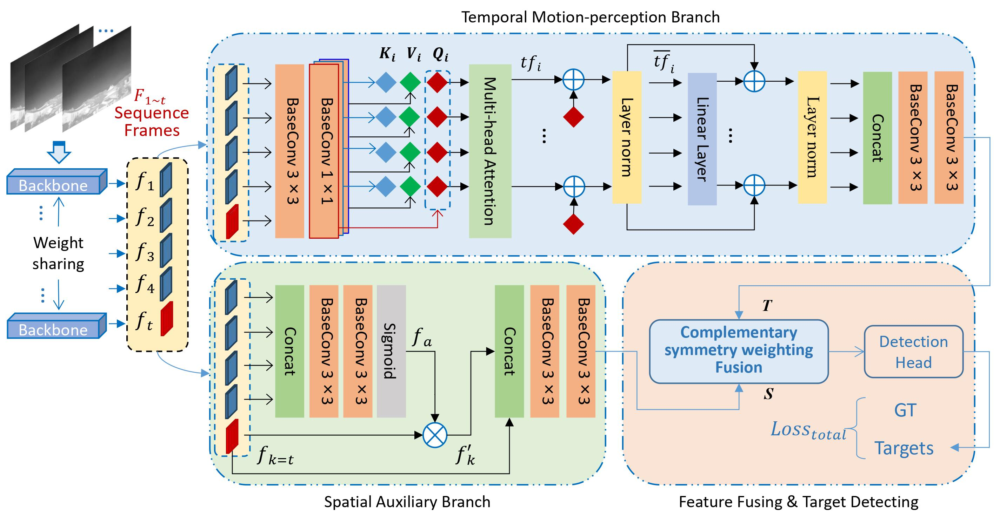
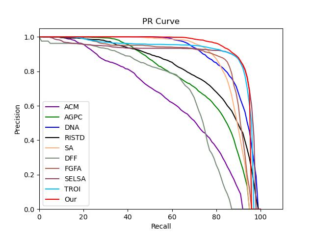
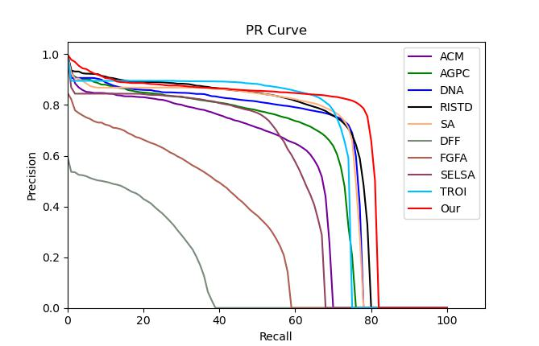

# TasaNet: temporal attention and spatial auxiliary network for moving Infrared dim and small target detection

## Model
<!-- <center>
    
    <br>
    <div style="color:orange; border-bottom: 1px solid #d9d9d9;
    display: inline-block;
    color: #999;
    padding: 2px;">TasaNet</div>
</center> -->

<center>TasaNet</center>


## PR results on the DAUB and IRDST datasets
<!-- <center>
    
    <br>
    <div style="color:orange; border-bottom: 1px solid #d9d9d9;
    display: inline-block;
    color: #999;
    padding: 2px;">DAUB</div>
</center> -->


<center>
    
    <br>
    <div style="color:orange; border-bottom: 1px solid #d9d9d9;
    display: inline-block;
    color: #999;
    padding: 2px;">IRDST</div>
</center>

## Datasets
### 1. [DUAB](https://www.scidb.cn/en/detail?dataSetId=720626420933459968) and [IRDST](https://xzbai.buaa.edu.cn/datasets.html)

### 2. The COCO format need to convert to txt format.
``` python 
python utils_coco/coco_to_txt.py
```
### 3. The class of dataset should write to a txt file. 
Such as model_data/classes.txt

## Train
The hyper-parameters are set in train.py
```python 
python tarin.py
```

## Evaluate
The hyper-parameters are set in vid_map_coco.py
```python 
python vid_map_coco.py
```

## Visualization
The hyper-parameters are setted in vid_predcit.py
```python 
python vid_predcit.py
```

## Reference
https://github.com/bubbliiiing/yolox-pytorch/